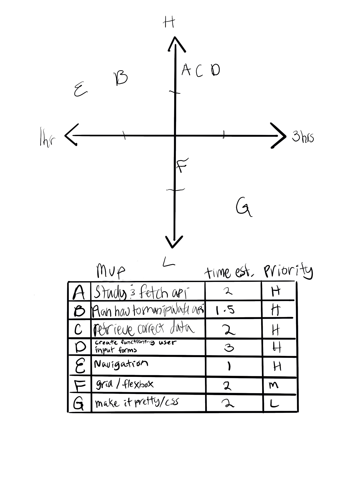

# Julie's Project 2: MadLibs
 For this project I will be creating a react application where the user will be able to add their own inputs for a MadLibs adventure that will be chosen for them at random. For this project I will be using this API: https://madlibz.herokuapp.com/ 

 ## Project Goals
  * Better Planning
  * A proper README.md
  * A complete project
  * Better time management
  * PRIORITIES - MVP and then do what you feel like
  * Higher productivity
  * Cleaner, clearer, working code
  * The ability to properly fetch apis
  * Understanding what is doing what and where and why and how
  * 5 components and 2 routes

  ## Wireframes

## MVP
 